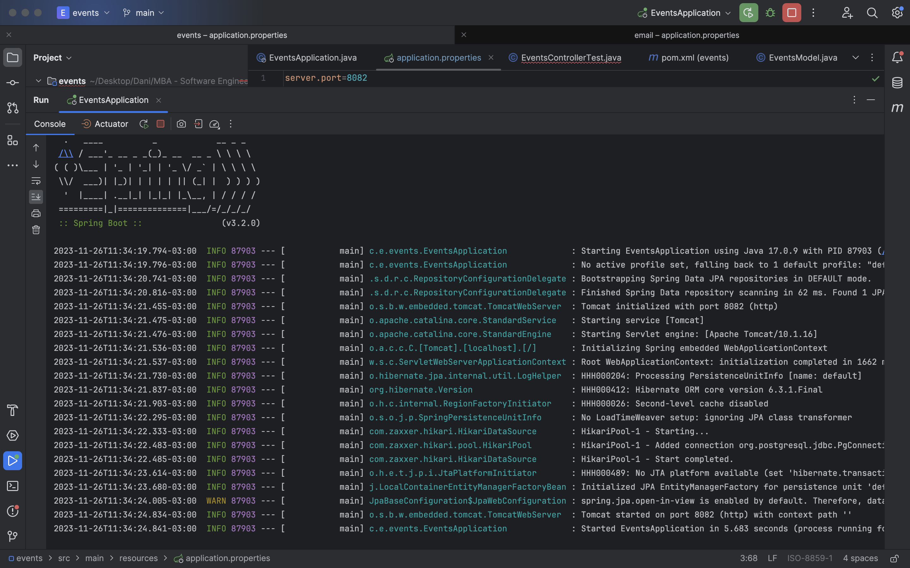
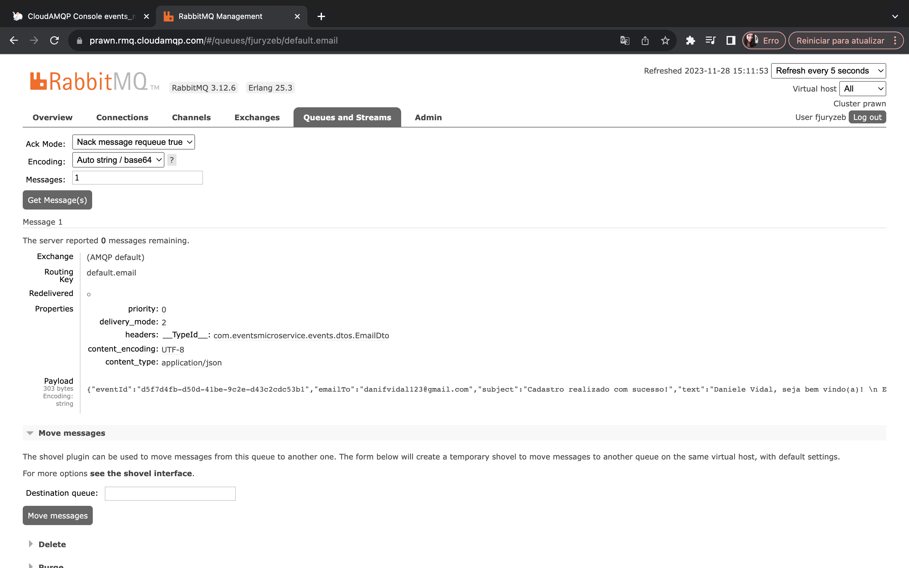
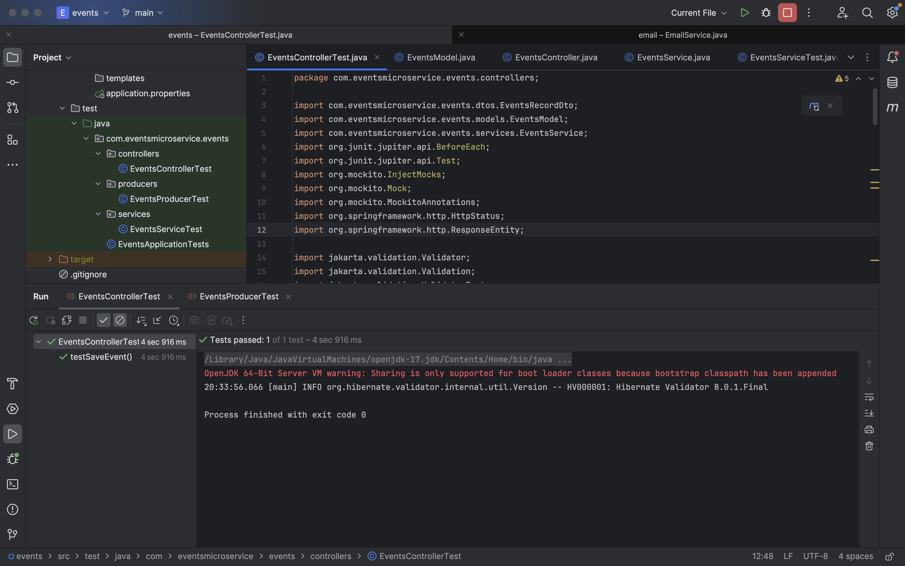

# Full Flow Asynchronous Communication - Projeto de Cadastro de Eventos
Este projeto em Java é um exemplo de arquitetura de microsserviços para um sistema de cadastro de eventos, utilizando comunicação assíncrona entre os serviços através de um broker RabbitMQ.

## Funcionamento
Quando um novo evento é cadastrado através da API (/events) no event-service, uma mensagem é enviada para a exchange do RabbitMQ. Essa mensagem é roteada para a fila específica do email-service, onde o microsserviço de email a consome e realiza o envio do email com os detalhes do evento.

## Estrutura do Projeto

O projeto está dividido em dois módulos:

* events: Microserviço responsável pelo cadastro de eventos.
  * `controllers`: Contém os endpoints da API REST para interagir com os eventos.
  * `services`: Lógica de negócio para processamento dos eventos.
  * `models`: Definições das entidades de dados.
  * `dtos`: Objetos de transferência de dados para comunicação entre serviços.
  * `repositories`: Acesso ao banco de dados PostgreSQL.
* email: Microserviço responsável por enviar emails quando um novo evento é cadastrado.
  * `consumers`: Responsável por consumir informações de outras fontes, sejam elas APIs externas, filas de mensagens, ou qualquer outro tipo de entrada de dados.
  * `dtos`: Objetos de transferência de dados para comunicação entre serviços.
  * `models`: Definições das entidades de dados.
  * `repositories`: Acesso ao banco de dados PostgreSQL.
  * `services`: Lógica de negócio para processamento do envio de email.

## Spring Boot
Este projeto utiliza o Spring Boot, um framework Java que simplifica o desenvolvimento de aplicativos baseados em Spring, fornecendo um ambiente pronto para uso, com configurações padrão e facilitando a criação de aplicativos robustos.


## Configuração e Execução

### Pré-requisitos
Certifique-se de ter instalado:

* Java 16 ou superior
* PostgreSQL
* RabbitMQ

### Configuração
1. Banco de Dados: Configure o arquivo application.properties no módulo event e email com as credenciais do banco de dados PostgreSQL.
2. RabbitMQ: Verifique e configure as propriedades de conexão com o RabbitMQ no arquivo de configuração do eventsService para que os eventos sejam publicados corretamente no broker.

### Execução
1. Clone este repositório.
2. Navegue até o diretório do event e execute:
   `./mvnw spring-boot:run`

## RabbitMQ


## Comunicação Assíncrona
Quando um novo evento é cadastrado via API no event-service, uma mensagem é enviada para a exchange do RabbitMQ. O emailService, conectado a essa exchange, receberá a mensagem e enviará um email com os detalhes do evento.

## Testes Unitários
O projeto utiliza JUnit e Mockito para realizar testes unitários nos serviços e controladores do event-service.


### Configuração
Certifique-se de ter as dependências necessárias no seu arquivo pom.xml para o JUnit e Mockito:
```
<dependency>
    <groupId>junit</groupId>
    <artifactId>junit</artifactId>
    <version>4.13.1</version>
    <scope>test</scope>
</dependency>
<dependency>
    <groupId>org.junit.jupiter</groupId>
    <artifactId>junit-jupiter-api</artifactId>
    <version>5.10.1</version>
    <scope>test</scope>
</dependency>
```

